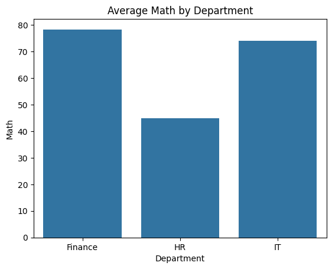

# Hour 3  - Exploratory Data Analysis (EDA) & Visualization

## Background

### 1. หลักการของ Exploratory Data Analysis (EDA)

EDA เป็นกระบวนการสำรวจข้อมูลเพื่อค้นหารูปแบบ ความสัมพันธ์ และความผิดปกติ ก่อนนำไปสู่การสร้างโมเดล โดยมีเป้าหมายหลักคือ

 

**📊 ข้อมูลสมมุติ: คะแนนสอบนักศึกษา**

| Student | Math | English | StudyHours | Attendance (%) |
| ------- | ---- | ------- | ---------- | -------------- |
| S1      | 80   | 75      | 10         | 90             |
| S2      | 60   | 65      | 6          | 70             |
| S3      | 95   | 88      | 15         | 95             |
| S4      | 40   | 50      | 3          | 60             |
| S5      | 85   | 82      | 12         | 92             |
| S6      | 30   | 35      | 2          | 55             |
| S7      | 78   | 70      | 9          | 85             |
| S8      | 55   | 58      | 5          | 65             |
| S9      | 98   | 90      | 16         | 96             |
| S10     | 45   | 55      | 4          | 62             |

---

 1. **สรุปข้อมูลเบื้องต้น (Descriptive Statistics)**

```python
import pandas as pd

data = {
    "Math": [80, 60, 95, 40, 85, 30, 78, 55, 98, 45],
    "English": [75, 65, 88, 50, 82, 35, 70, 58, 90, 55],
    "StudyHours": [10, 6, 15, 3, 12, 2, 9, 5, 16, 4],
    "Attendance": [90, 70, 95, 60, 92, 55, 85, 65, 96, 62]
}
df = pd.DataFrame(data)
print(df.describe())
```

📌 **การแปลผล**

* ค่าเฉลี่ย (mean) ของคณิตศาสตร์ = \~66.6 แปลว่าคะแนนนักศึกษาส่วนใหญ่ปานกลาง
* ค่ามัธยฐาน (median) ของการเข้าเรียน = 77.5 แปลว่าครึ่งหนึ่งมาเรียนเกิน 77.5%
* ค่า SD (ส่วนเบี่ยงเบนมาตรฐาน) ของ StudyHours สูง → บางคนอ่านหนังสือมากผิดปกติเมื่อเทียบกับเพื่อน
 
2. **ตรวจสอบโครงสร้างของข้อมูล**

**Distribution**

```python
import seaborn as sns
import matplotlib.pyplot as plt

sns.histplot(df["Math"], bins=5, kde=True)
plt.show()
```

ความหมายของพารามิเตอร์หลักมีดังนี้

1. `df["Math"]`

* คือซีรีส์ตัวเลข (คอลัมน์ Math) ที่ใช้เป็นข้อมูลอินพุตในการสร้างฮิสโตแกรม แกน x = คะแนน Math และแกน y = จำนวน/ความหนาแน่นของสังเกตในแต่ละช่วง

2. `bins=5`

* กำหนด  intervals  ของฮิสโตแกรมให้เป็น 5 ช่วงเท่า ๆ กันโดยอัตโนมัติในช่วงค่าของข้อมูล (min → max)
* ผลคือแผนภูมิจะสรุปการกระจายของคะแนน Math ออกเป็น 5 กล่อง/แท่ง
* หมายเหตุ: นอกจากใส่เป็นจำนวนเต็มได้ ยังสามารถใส่เป็นลิสต์ของขอบช่วง (เช่น `bins=[0,50,60,70,80,100]`) เพื่อกำหนดช่วงเอง หรือใช้สตริงบางค่า (เช่น `"auto"`, `"sturges"`) ให้ Seaborn/NumPy เลือก intervals ตามกฎเชิงสถิติ

3. `kde=True`

* สั่งให้วาดเส้น **Kernel Density Estimate (KDE)** ทับบนฮิสโตแกรม เพื่อประมาณ “ฟังก์ชันความหนาแน่นต่อเนื่อง” ของข้อมูล (เป็นเส้นโค้งลื่น ๆ)
* ช่วยมองเห็นรูปทรงการกระจาย (เช่น unimodal/bimodal, หางยาว) ชัดขึ้นกว่าฮิสโตแกรมล้วน ๆ
* หากไม่ต้องการเส้นนี้ให้ตั้ง `kde=False` (ค่าเริ่มต้นมักเป็น False)

การตีความโดยรวม

* ฮิสโตแกรม (กำหนดด้วย `bins`) แสดง “ความถี่ในแต่ละช่วงค่า” ส่วน KDE แสดง “ความหนาแน่นโดยประมาณแบบต่อเนื่อง” การดูร่วมกันช่วยทั้งความชัดของจำนวนสังเกตและรูปทรงการกระจาย

ตัวอย่างปรับแต่งสั้น ๆ

```python
# กำหนดช่วง bin เอง
sns.histplot(df["Math"], bins=[0,50,60,70,80,100], kde=True)

# แสดงเป็นสัดส่วน (ความหนาแน่น) แทนจำนวน
sns.histplot(df["Math"], bins=7, kde=True, stat="density")
```


📌 **การแปลผล**

* Histogram แสดงว่าคะแนนคณิตศาสตร์มีการกระจายกว้าง บางคนได้คะแนนต่ำมาก (30–40) แต่บางคนสูงมาก (95–98) → ข้อมูลกระจายสองฝั่ง (high vs low performers)

  Correlation

```python
print(df.corr())
sns.heatmap(df.corr(), annot=True, cmap="coolwarm")
plt.show()
```

📌 **การแปลผล**

* พบว่า **StudyHours มีค่าสหสัมพันธ์สูงกับ Math (r ≈ 0.95)** → ยิ่งอ่านหนังสือมาก คะแนนคณิตยิ่งสูง
* English ก็สัมพันธ์กับ Math (r ≈ 0.9) → นักเรียนที่เก่งมักจะทำได้ดีทั้งสองวิชา

  3. **ค้นหา Outlier**

**Boxplot**

```python
sns.boxplot(x=df["Math"])
plt.show()
```

**การแปลผล**

* เห็นว่า **คะแนน Math = 30** (นักเรียน S6) เป็น Outlier เพราะต่ำกว่ากลุ่มมาก
* อาจสะท้อนว่ามีปัญหาเฉพาะบุคคล (ไม่เข้าเรียน, ไม่อ่านหนังสือ) ที่ต่างจากเพื่อน ๆ

 4. **สร้างสมมติฐานเบื้องต้น**

จากการสังเกตเบื้องต้น สามารถตั้งสมมติฐานได้ว่า:

1. นักศึกษาที่มี **ชั่วโมงการอ่านหนังสือมากกว่า 10 ชั่วโมง/สัปดาห์** จะได้คะแนนคณิตศาสตร์สูงกว่า 80 คะแนน
2. อัตราการเข้าเรียนที่สูงกว่า 85% จะสัมพันธ์กับคะแนนภาษาอังกฤษสูงกว่า 75 คะแนน
3. Outlier เช่น S6 ควรศึกษาเพิ่มเติมว่าเกิดจากปัจจัยอื่น เช่น ขาดแรงจูงใจหรือมีปัญหาด้านการเรียน
 

### 2. หลักการเลือกกราฟที่เหมาะสม

 
**📊 ข้อมูลสมมุติ: ข้อมูลนักศึกษา**

| Student | Math | English | StudyHours | Department |
| ------- | ---- | ------- | ---------- | ---------- |
| S1      | 80   | 75      | 10         | IT         |
| S2      | 60   | 65      | 6          | HR         |
| S3      | 95   | 88      | 15         | Finance    |
| S4      | 40   | 50      | 3          | IT         |
| S5      | 85   | 82      | 12         | Finance    |
| S6      | 30   | 35      | 2          | HR         |
| S7      | 78   | 70      | 9          | IT         |
| S8      | 55   | 58      | 5          | Finance    |
| S9      | 98   | 90      | 16         | IT         |
| S10     | 45   | 55      | 4          | HR         |


```python
# !pip install seaborn plotly --quiet   # (หากยังไม่มี ให้เปิดคอมเมนต์บรรทัดนี้)
import pandas as pd
import numpy as np
import seaborn as sns
import matplotlib.pyplot as plt

# สร้างข้อมูลนักศึกษา (สมมุติ)
df = pd.DataFrame({
    "Student": [f"S{i}" for i in range(1, 11)],
    "Math": [80,60,95,40,85,30,78,55,98,45],
    "English": [75,65,88,50,82,35,70,58,90,55],
    "StudyHours": [10,6,15,3,12,2,9,5,16,4],
    "Department": ["IT","HR","Finance","IT","Finance","HR","IT","Finance","IT","HR"]
})

df.head()
```

### 1. ข้อมูลเชิงปริมาณ (Numeric Data)

**Histogram (การกระจายของคะแนน Math)**

* ใช้ดูว่าคะแนนนักศึกษากระจายอยู่ช่วงใดบ้าง
```python
display(df.describe())  # mean, std, quartiles สำหรับตัวเลข
print("ค่าเฉลี่ยรายแผนก (Math):")
print(df.groupby("Department")["Math"].mean())

# แนวทางแปลผล:
# - mean/std บอกระดับและการกระจายโดยรวม
# - groupby ช่วยดูความต่างเชิงหมวดหมู่ (เช่น IT vs HR vs Finance)

# Histogram: การกระจายของคะแนน Math
sns.histplot(df["Math"], bins=5, kde=True)
plt.title("Histogram of Math Scores")
plt.xlabel("Math")
plt.ylabel("Count")
plt.show()
# ตีความ: ดูรูปทรงการกระจาย (มีหาง/หลายยอด/คับแน่นช่วงใด)

```
* **แปลผล:** เห็นว่าคะแนนมีทั้งกลุ่มต่ำ (30–40) และกลุ่มสูง (80–100) → distribution อาจเป็น **bimodal**


**การอ่านและตีความ Histogram + KDE: Math**

* **รูปทรงการกระจาย:** เส้น KDE แสดงสัญญาณ **สองสัน (bimodal)**—กลุ่มคะแนนต่ำ–กลางราว **40–60** และกลุ่มสูงราว **80–95+** สะท้อนความแตกต่างเชิงสมรรถนะระหว่างผู้เรียนสองกลุ่มอย่างชัดเจน
* **ช่วงค่า (Range):** ประมาณ **30–98** แปลว่าคะแนนกระจายกว้างมาก มีทั้งผู้ที่ทำได้ต่ำมากและสูงมาก
* **ความหนาแน่นของแต่ละช่วง:** ช่วง **80–95** มีความหนาแน่นสูงสุด (ยอดโค้งสูงกว่าแท่งอื่น) ขณะที่ช่วง **60–70** ค่อนข้างบาง—อาจเป็น “ช่องว่าง” ระหว่างสองกลุ่ม
* **สเกลของถัง (bins=5):** ใช้เพียง 5 ถังช่วยให้เห็นภาพรวม แต่รายละเอียดระดับจุลภาคอาจถูกกลบ ควรลองปรับ `bins` (เช่น 7–10) เพื่อตรวจสอบความมั่นคงของรูปทรงการกระจาย
* **นัยเชิงสอน/นโยบาย:** การมีสองกลุ่มเด่นชี้ว่าควร **ออกแบบแทร็กการเรียนรู้แยก** (remedial สำหรับกลุ่ม 40–60 และ enrichment สำหรับกลุ่ม 80+) พร้อมสำรวจปัจจัยร่วม เช่น `StudyHours`, การเข้าเรียน, หรือพื้นฐานเดิม
* **ข้อควรระวัง:** ขนาดตัวอย่างเล็กทำให้ KDE อ่อนไหวต่อพารามิเตอร์ (bandwidth) และการเลือกจำนวนถัง จึงควร **ยืนยันด้วยสถิติเชิงสรุป** (mean/median/IQR) และกราฟเสริม (boxplot, violin) ตลอดจนทดสอบความแตกต่างระหว่างกลุ่มถ้าจะแปลผลเชิงอนุมาน

> สรุป: การกระจายลักษณะ **bimodal** บ่งชี้ความไม่เป็นเอกพันธ์ของประชากรผู้เรียน ซึ่งมีนัยต่อการสอนและการสร้างแบบจำลอง (อาจพิจารณาแบ่งกลุ่มก่อนทำโมเดลเชิงพยากรณ์).


**Boxplot (การกระจายของ English)**

* ใช้หาค่า outlier และสรุปค่ากลางของข้อมูล
```python

# Boxplot: Outlier + การกระจายของ English
sns.boxplot(x=df["English"])
plt.title("Boxplot of English Scores")
plt.xlabel("English")
plt.show()
# ตีความ: ตำแหน่ง median, IQR, จุด outliers (ค่าผิดปกติ)

```

* **แปลผล:** ค่า median ประมาณ 70 แต่มี outlier ต่ำ (35 คะแนน) → บ่งชี้ว่านักศึกษา HR บางคนอาจมีปัญหาด้านภาษา


* การอ่านและตีความ Boxplot: English Scores*

* **ค่ากลาง (Median):** เส้นกลางกล่องอยู่ราว **\~68–70 คะแนน** สะท้อนค่ากลางของผลสัมฤทธิ์วิชาภาษาอังกฤษ
* **การกระจายภายใน (IQR):** ขอบกล่อง (Q1–Q3) ประมาณ **\~58 ถึง \~80** → **IQR ≈ 22 คะแนน** แสดงความแปรปรวนระดับปานกลาง ผู้เรียนครึ่งกลาง 50% อยู่ในช่วงนี้
* **ขอบหนวด (Whiskers):** ซ้ายราว **\~35** และขวาราว **\~90** แสดงค่าต่ำสุด–สูงสุดภายในเกณฑ์ 1.5×IQR จากควอไทล์
* **Outliers:** ไม่เห็นจุดข้อมูลนอกหนวด → **ไม่มี outlier ชัดเจน** ในชุดนี้
* **รูปร่างการกระจาย:** ตำแหน่ง median ค่อนมาทางขอบขวาเล็กน้อย บ่งชี้การกระจาย **เอียงซ้ายเล็กน้อย** (มีค่าต่ำกระจายมากกว่าด้านสูง) แต่โดยรวมค่อนข้างสมมาตร

 ** นัยเชิงวิเคราะห์**

* ผลสัมฤทธิ์ส่วนใหญ่กระจุกในช่วง 58–80 คะแนน มีผู้เรียนส่วนน้อยที่ต่ำมาก (\~35) หรือสูงมาก (\~90)
* เนื่องจากไม่มี outlier เด่น การใช้สถิติสรุปอย่างค่าเฉลี่ย/ส่วนเบี่ยงเบนมาตรฐานร่วมกับ boxplot จึงเหมาะสม
* หากต้องการเห็นรูปทรงการกระจายละเอียดขึ้น แนะนำเสริม **histogram/KDE** หรือ **violin plot**
* เพื่อตรวจความต่างระหว่างกลุ่ม (เช่น Department/เพศ/ชั้นปี) ใช้ **boxplot แยกกลุ่ม** และทดสอบสถิติ (เช่น t-test/ANOVA) ร่วมด้วยเพื่อข้อสรุปที่มีนัยสำคัญทางสถิติ.


**Scatter plot (Math vs StudyHours)**

* ใช้ตรวจสอบความสัมพันธ์ระหว่างชั่วโมงอ่านหนังสือกับคะแนน
```python

# Scatter: ความสัมพันธ์ Math vs StudyHours
sns.scatterplot(x="StudyHours", y="Math", data=df)
plt.title("StudyHours vs Math")
plt.xlabel("StudyHours")
plt.ylabel("Math")
plt.show()
# ตีความ: ความชันโดยรวมเป็นบวก? จุดกระจายแน่น/หลวม? มีจุดผิดปกติหรือไม่?
```
 


**การอ่านและตีความสแคตเตอร์พล็อต: StudyHours vs Math**
* **รูปทรงความสัมพันธ์:** จุดข้อมูลจัดเรียงตามแนวเพิ่มขึ้นอย่างสม่ำเสมอ แสดง **ความสัมพันธ์เชิงบวกแบบเกือบเชิงเส้น (approximately linear positive relationship)**—ชั่วโมงอ่านมากขึ้นสัมพันธ์กับคะแนนคณิตที่สูงขึ้น
* **ความแรงของความสัมพันธ์:** ด้วยสายตา จุดกระจายแคบใกล้แนวเส้นตรง สื่อว่า **ค่าสหสัมพันธ์ (Pearson’s r) น่าจะสูงมาก**
* **Outliers/Anomalies:** ไม่พบจุดที่เบี่ยงจากแนวโน้มเด่นชัด (ไม่มี outlier ที่กระทบความชันอย่างรุนแรง)
* **ความแปรปรวนตามระดับ (Heteroscedasticity):** การกระจายของจุดค่อนข้างสม่ำเสมอตลอดช่วงเวลาอ่าน ไม่เห็นรูปพัดชัดเจน → สมมติฐานความแปรปรวนคงที่ของถดถอยเชิงเส้นมีแนวโน้มสอดคล้อง
* **นัยเชิงปฏิบัติ:** การเพิ่มชั่วโมงอ่านอาจเกี่ยวข้องกับการยกระดับคะแนน แต่ **สหสัมพันธ์ไม่ใช่เหตุ–ผล** จำเป็นต้องมีการออกแบบทดลอง/ควบคุมปัจจัยร่วม (เช่น ความสามารถพื้นฐาน, คุณภาพการสอน) ก่อนสรุปเชิงสาเหตุ
* **ข้อเสนอการสร้างแบบจำลอง:** เริ่มด้วย **Simple Linear Regression** และรายงานค่าสัมประสิทธิ์ความชัน (β₁), ค่า $R^2$, ตรวจสมมติฐาน (เช่น ความเป็นเส้นตรง, ความเป็นปกติของเศษเหลือ) หากมีความโค้งในอนาคตอาจเพิ่มเทอมกำลังสองหรือใช้แบบจำลองไม่เชิงเส้น

### โค้ดสั้น ๆ เพื่อยืนยันเชิงปริมาณ

```python
import numpy as np
from scipy.stats import pearsonr
from sklearn.linear_model import LinearRegression

X = df[["StudyHours"]].values
y = df["Math"].values

# Pearson correlation
r, p = pearsonr(X.ravel(), y)
print(f"Pearson r = {r:.2f}, p-value = {p:.3g}")

# Simple Linear Regression + R^2
lr = LinearRegression().fit(X, y)
print(f"slope (β1) = {lr.coef_[0]:.2f}, intercept (β0) = {lr.intercept_:.2f}, R^2 = {lr.score(X,y):.3f}")
```
```
Pearson r = 0.98, p-value = 8.25e-07
slope (β1) = 4.69, intercept (β0) = 28.14, R^2 = 0.959
```
> หาก $r$ และ $R^2$ สูง พร้อมกราฟเศษเหลือ (residual plot) ไม่ผิดสมมติฐานมาก จะยืนยันข้อสังเกตจากกราฟได้อย่างเป็นระบบ.


### 2. ข้อมูลเชิงหมวดหมู่ (Categorical Data)

**Bar chart (คะแนนเฉลี่ยของแต่ละแผนก)**

* แสดงค่าเฉลี่ยของ Department: IT, HR, Finance
```python
# Bar chart: คะแนนเฉลี่ย Math ต่อ Department
dept_mean = df.groupby("Department")["Math"].mean().reset_index()
sns.barplot(x="Department", y="Math", data=dept_mean)
plt.title("Average Math by Department")
plt.show()
# ตีความ: แผนกใดมีค่าเฉลี่ยสูง/ต่ำกว่ากัน? ความต่างอาจสะท้อนปัจจัยด้านการเรียนรู้

```


**การอ่านและตีความแผนภูมิแท่ง: Average Math by Department**

* กราฟแสดง **คะแนนเฉลี่ยวิชาคณิตศาสตร์** แยกตามแผนก พบลำดับโดยประมาณ: **Finance ≈ 78–79** > **IT ≈ 73–75** >> **HR ≈ 45**
* **นัยเชิงพรรณนา:** นักศึกษากลุ่ม Finance และ IT มีผลสัมฤทธิ์คณิตสูงกว่า HR อย่างชัดเจน ขณะที่ความแตกต่างระหว่าง Finance กับ IT มีขนาดเล็กกว่ามาก (gap \~4–6 คะแนน)
* **ข้อควรระวัง:** แผนภูมิไม่แสดง **ความไม่แน่นอน** (variance/SD) หรือ **จำนวนตัวอย่าง (n)** ต่อกลุ่ม จึงยังฟันธงไม่ได้ว่าความต่างมีนัยสำคัญทางสถิติ

**ข้อเสนอแนะการวิเคราะห์เพิ่มเติม**

1. **ใส่ Error Bars** (เช่น SD หรือ 95% CI) เพื่อสื่อความแปรปรวนของแต่ละแผนก
2. **ทดสอบสถิติ**: ใช้ **ANOVA แบบหนึ่งปัจจัย** เพื่อตรวจว่าค่าเฉลี่ยต่างกันอย่างมีนัยสำคัญหรือไม่ และทำ **post-hoc** (Tukey HSD) เพื่อตรวจคู่ที่ต่างกันจริง
3. **ควบคุมปัจจัยร่วม (Confounders)**: หากมีตัวแปรอื่นที่อาจมีผลต่อคะแนน (เช่น StudyHours, Attendance) ควรใช้ **ANCOVA** หรือ **แบบจำลองถดถอย** เพื่อตัดอิทธิพลปัจจัยร่วมก่อนสรุปเชิงสาเหตุ
4. **รายงานขนาดอิทธิผล** (effect size เช่น η², Cohen’s d) ควบคู่ค่า p เพื่อบอก “ความใหญ่ของความต่าง” ไม่ใช่เพียงความมีนัยสำคัญ

**ตีความเชิงปฏิบัติ**

* หากยืนยันความต่างด้วยสถิติ: HR อาจต้อง **เสริมกลยุทธ์สนับสนุน** เช่น คลินิกคณิต/ติวเพิ่มชั่วโมงเรียน ขณะที่ Finance/IT สามารถทำ **โครงการต่อยอด** สำหรับผู้เรียนที่ทำได้ดี เพื่อรักษาระดับและสร้างแรงจูงใจ.


**Pie chart (สัดส่วนนักศึกษาแต่ละแผนก)**

* ใช้เมื่อหมวดหมู่ไม่เกิน 4–5 กลุ่ม
```python
# Pie chart: สัดส่วนนักศึกษาแต่ละแผนก
counts = df["Department"].value_counts()
plt.pie(counts, labels=counts.index, autopct="%1.1f%%")
plt.title("Department Proportion")
plt.show()
# ตีความ: ใช้เมื่อหมวดหมู่ไม่เกิน ~4–5 กลุ่ม เพื่อสื่อสัดส่วนอย่างง่าย
```


* กราฟแสดง **สัดส่วนจำนวนนักศึกษา** ตามแผนก: **IT = 40%**, **HR = 30%**, **Finance = 30%**
* ภาพรวม: IT เป็นกลุ่มใหญ่ที่สุด (มากกว่า HR/Finance 10 จุดร้อยละ) ส่วน HR และ Finance มีสัดส่วนเท่ากัน → โครงสร้างกลุ่มค่อนข้างสมดุล ไม่มีการกระจุกตัวรุนแรง
* นัยต่อการวิเคราะห์/การสอน:
  * หากจะเปรียบเทียบค่าเฉลี่ยคะแนนรายแผนก ควรพิจารณาความต่างของขนาดกลุ่ม (IT ใหญ่กว่า อาจทำให้ค่าเฉลี่ยรวมโน้มเอียง)
  * การแบ่งทรัพยากรหรือจัดกิจกรรม อาจจัดสรรให้สอดคล้องกับสัดส่วนนี้ (IT มากสุด)
* ข้อควรระวังเมื่อใช้ **pie chart**:
  * เหมาะเมื่อหมวดหมู่มี **ไม่เกิน \~4–5 กลุ่ม** และต้องการสื่อ “สัดส่วนของทั้งหมด”
  * การเปรียบเทียบความต่างระหว่างชิ้นที่ใกล้เคียง (30% vs 30%) ทำได้ยากด้วยสายตา → ถ้าต้องการเทียบขนาดอย่างแม่นยำ แนะนำใช้ **bar chart** แทน
* ข้อเสนอแนะเพิ่มเติม: แสดง **จำนวนตัวอย่าง (n)** ต่อกลุ่มบนกราฟหรือในคำอธิบาย และถ้าจะวิเคราะห์ผลสัมฤทธิ์รายแผนก ควรเสริมกราฟ **bar ของค่าเฉลี่ย/มัธยฐานคะแนน** พร้อม **ช่วงความเชื่อมั่น** เพื่อหลีกเลี่ยงความเข้าใจผิดจากสัดส่วนเพียงอย่างเดียว.

3. ข้อมูลหลายมิติ

**Heatmap (Correlation Matrix)**

* แสดงความสัมพันธ์ของ Math, English, StudyHours
```python
corr = df[["Math","English","StudyHours"]].corr()
sns.heatmap(corr, annot=True, fmt=".2f")
plt.title("Correlation Matrix")
plt.show()
```


1. **ความหมายของค่า**

* `Math–English ≈ 0.98`, `Math–StudyHours ≈ 0.98`, `English–StudyHours ≈ 0.97`
  หมายถึงความสัมพันธ์เชิงเส้น **บวกสูงมากผิดปกติ** (near-perfect). เมื่อค่าหนึ่งเพิ่ม อีกค่ามักเพิ่มตามในสัดส่วนเกือบเป็นเส้นตรง

2. **นัยต่อการวิเคราะห์เชิงพรรณนา**

* ผู้เรียนที่มีชั่วโมงอ่านมากมักได้คะแนนสูงทั้งคณิตและอังกฤษ
* ผู้ที่ได้คณิตสูงมักได้อังกฤษสูงด้วย สะท้อน “สมรรถนะการเรียนรู้โดยรวม/วินัย” ที่คล้ายกันในสองวิชา

3. **ข้อควรระวังทางสถิติ**

* ค่าสูงใกล้ 1 บ่งชี้ **ความซ้ำซ้อนของตัวแปร (multicollinearity)**; หากนำทั้งสามตัวแปรเข้าแบบจำลองถดถอยเดียวกัน ค่าสัมประสิทธิ์อาจไม่เสถียร (variance สูง, สัญญาณกลับเครื่องหมายได้)
* ค่าสหสัมพันธ์สูงอาจเกิดจากขนาดตัวอย่างน้อย, ช่วงค่าจำกัด, หรือ outlier ที่ “ดึง” เส้นเข้าหากัน ควรตรวจสอบ scatter plot, boxplot, และความทนทานต่อ outliers

4. **สิ่งที่ยังสรุปไม่ได้**

* สหสัมพันธ์ **ไม่ใช่เหตุ–ผล** (correlation ≠ causation) จึงยังยืนยันไม่ได้ว่า “อ่านมากขึ้นทำให้คะแนนสูงขึ้น” ต้องอาศัยการออกแบบทดลอง/วิธีเชิงสาเหตุเพิ่มเติม

5. **ข้อเสนอแนะเชิงปฏิบัติ**

* หากสร้างโมเดลพยากรณ์ ให้พิจารณา

  * เลือกตัวแปรตัวแทน (เช่น ใช้ `StudyHours` เพียงตัวเดียว) หรือ
  * ใช้ **regularization** (Ridge/Lasso) หรือ **PCA** ลดมิติ เพื่อบรรเทา multicollinearity
* คำนวณ **VIF (Variance Inflation Factor)** ตรวจสอบความซ้ำซ้อน, ทดสอบ **partial correlation** เพื่อดูความสัมพันธ์หลังควบคุมตัวแปรอื่น
* รายงานผลพร้อมช่วงความเชื่อมั่น/ทดสอบนัยสำคัญ และแนบกราฟกระจายเพื่อให้ผู้อ่านเห็นรูปทรงความสัมพันธ์จริงร่วมด้วย

สรุป: เมทริกซ์นี้ชี้ว่า 3 ตัวแปรมีความสัมพันธ์บวกแรงมากและเกือบซ้ำซ้อน จึงต้องระวังในการตีความและการสร้างแบบจำลองเชิงเส้น พร้อมใช้เทคนิคลดผลกระทบของ multicollinearity.


**Pair plot**

* ใช้ดูการกระจายและความสัมพันธ์ของตัวแปรหลายมิติพร้อมกัน
```python
sns.pairplot(df[["Math","English","StudyHours"]], diag_kind="hist")
plt.show()
```


**1) การกระจาย (Diagonal – Histograms)**

* **Math**: กระจายกว้าง ครอบคลุมช่วงคะแนนต่ำถึงสูงมาก มีสัญญาณของความไม่สม่ำเสมอ (กลุ่มคะแนนต่ำ\~40–50 และกลุ่มสูง\~80–100) บ่งชี้ความแตกต่างของสมรรถนะระหว่างผู้เรียน
* **English**: กระจายค่ากลาง–สูง ค่อนข้างเอียงซ้ายเล็กน้อย (มีคะแนนสูงมากพอสมควร)
* **StudyHours**: เอนไปทางค่าน้อย (ส่วนใหญ่เรียน 3–10 ชม./สัปดาห์) แต่มีหางขวาถึง \~15–16 ชม. แสดงผู้เรียนบางคนทุ่มเวลาอ่านมากกว่ากลุ่มหลัก

**2) ความสัมพันธ์ระหว่างตัวแปร (Off-diagonal – Scatter plots)**

* **Math ↔ StudyHours**: ความสัมพันธ์เชิงบวกชัดเจน (จุดเรียงตัวตามแนวเส้นขึ้น) บ่งชี้ว่าชั่วโมงอ่านที่มากขึ้นสัมพันธ์กับคะแนนคณิตที่สูงขึ้น มีแนวโน้มเชิงเส้นชัด ไม่มีรูปทรงโค้งหรือความไม่เชิงเส้นเด่นชัด
* **English ↔ StudyHours**: ความสัมพันธ์เชิงบวกเช่นกัน แม้ความชันอาจอ่อนกว่า Math เล็กน้อย สะท้อนว่าการอ่านมากขึ้นสัมพันธ์กับผลสัมฤทธิ์ภาษาอังกฤษ
* **Math ↔ English**: สัมพันธ์เชิงบวกค่อนข้างแรง ผู้ที่ได้คณิตสูงมักได้อังกฤษสูงด้วย อาจสะท้อนทักษะการเรียนรู้โดยรวม/วินัย

**3) Outliers / Anomalies**

* พบจุดคะแนนต่ำพร้อมชั่วโมงอ่านต่ำในหลายช่อง ซึ่งสอดคล้องกับคาดหมาย จึงไม่ใช่ความผิดปกติรุนแรง
* ไม่มี outlier โดดเด่นด้านบนซ้าย/ล่างขวาที่จะชี้ความสัมพันธ์เชิงลบ

**4) ข้อสรุปเชิงตีความ**

* โครงสร้างข้อมูลสอดคล้องกับสมมติฐาน “อ่านมากขึ้น → คะแนนสูงขึ้น” โดยเฉพาะคณิตศาสตร์
* เนื่องจากความสัมพันธ์ดูเชิงเส้น การใช้สถิติเชิงสหสัมพันธ์ (เช่น Pearson’s r) และแบบจำลองเชิงเส้นอาจเหมาะสม
* ความเป็นไปได้ของ “สองกลุ่มสมรรถนะ” ใน Math ชวนให้พิจารณาแบ่งกลุ่มผู้เรียน (เช่น ตาม StudyHours/Attendance) เพื่อออกแบบการสอนเฉพาะกลุ่มต่อไป


**✅ หลักการเลือกกราฟ**

* Histogram/Boxplot → ดีสำหรับ numeric distribution
* Scatter plot → ดีสำหรับความสัมพันธ์ระหว่างตัวแปรสองตัว
* Bar chart/Pie chart → ดีสำหรับ categorical comparison
* Heatmap/Pair plot → ดีสำหรับความสัมพันธ์หลายตัวแปร
* ควรใช้สีที่เหมาะสม, หลีกเลี่ยง scale บิดเบือน และเลือก visualization ที่สื่อสารชัดเจนที่สุด

### 3. Storytelling with Data

Visualization ไม่ใช่แค่การแสดงกราฟ แต่คือการ **เล่าเรื่องจากข้อมูล (Data Storytelling)** ซึ่งมีหลักการคือ:

1. **กำหนดประเด็นหลัก (Key Message):** ต้องการให้ผู้ชมเข้าใจอะไร? เช่น “ยอดขายเพิ่มขึ้นใน Q3”
2. **เลือก visualization ที่สนับสนุนข้อความนั้น:** เช่น line chart เพื่อเล่าแนวโน้มตามเวลา
3. **ลดสิ่งรบกวน (Decluttering):** ตัด labels, gridlines หรือสีที่ไม่จำเป็นออก
4. **เน้นข้อมูลสำคัญ (Highlighting):** ใช้สีหรือ annotation เพื่อดึงความสนใจไปที่ insight
5. **เล่าเป็นเรื่องราว (Narrative):** จาก introduction → insight → conclusion

 

## ชุดข้อมูลสมมุติ (ยอดขายรายสัปดาห์ของปีหนึ่ง ๆ)

สมมุติว่าเราอยากสื่อสารประเด็นหลัก: **“ยอดขายเพิ่มขึ้นชัดเจนในไตรมาส 3 (Q3)”**

```python
import pandas as pd
import numpy as np

# สร้างข้อมูลรายสัปดาห์ 52 สัปดาห์
rng = pd.date_range("2024-01-01", periods=52, freq="W")
np.random.seed(7)
base = np.linspace(100, 140, 52)                 # แนวโน้มโดยรวมเพิ่มขึ้นเล็กน้อย
season = 10*np.sin(np.linspace(0, 6*np.pi, 52))  # ฤดูกาล
noise = np.random.normal(0, 5, 52)
sales = base + season + noise

# กระตุ้น Q3 (สัปดาห์ ~27–39) ให้โดดเด่น
q3_idx = (rng.quarter == 3)
sales[q3_idx] += 15

df = pd.DataFrame({"week": rng, "sales": sales})
df["quarter"] = df["week"].dt.quarter
```


1) กำหนดประเด็นหลัก (Key Message)

> “ยอดขายเพิ่มขึ้นเด่นชัดใน Q3 เมื่อเทียบกับ Q1–Q2 และยังคงทรงตัวสูงใน Q4”

**วิธีคิด:** ประเด็นต้องสั้น ชัดเจน ตอบคำถาม “So what?”—สิ่งที่ผู้ชมควรรับไปตัดสินใจได้


 2) เลือก visualization ให้สอดคล้องกับประเด็น

เพราะเป็น **แนวโน้มตามเวลา** → เลือก **line chart** เป็นกราฟหลัก และเสริมด้วย **bar chart แบบสรุปเฉลี่ยรายไตรมาส** เพื่อยืนยันภาพรวม

**Line Chart: แนวโน้มรายสัปดาห์**

```python
import matplotlib.pyplot as plt

fig, ax = plt.subplots(figsize=(9,4))
ax.plot(df["week"], df["sales"])
ax.set_title("Weekly Sales (2024)")
ax.set_xlabel("Week")
ax.set_ylabel("Sales")
plt.show()
```

**Quarterly Bar: ค่าเฉลี่ยยอดขายรายไตรมาส**

```python
q_summary = df.groupby("quarter")["sales"].mean().reset_index()

fig, ax = plt.subplots(figsize=(6,4))
ax.bar(q_summary["quarter"].astype(str), q_summary["sales"])
ax.set_title("Average Sales by Quarter")
ax.set_xlabel("Quarter")
ax.set_ylabel("Average Sales")
plt.show()
```

**ตีความ:** Q3 มีค่าเฉลี่ยสูงกว่าไตรมาสอื่นอย่างเห็นได้ชัด สนับสนุน key message

 

 3) ลดสิ่งรบกวน (Decluttering)

ลบองค์ประกอบที่ไม่จำเป็น เพื่อลด cognitive load ของผู้ชม

```python
fig, ax = plt.subplots(figsize=(9,4))
ax.plot(df["week"], df["sales"])

# Declutter: ตัดกริดย่อย/เส้นกรอบที่ไม่จำเป็น, ลดจำนวน ticks
ax.grid(False)
for spine in ["top","right"]:
    ax.spines[spine].set_visible(False)
ax.set_xticks(df["week"][::6])  # ทุก 6 สัปดาห์
ax.set_title("Weekly Sales (Decluttered)")
ax.set_xlabel("Week")
ax.set_ylabel("Sales")
plt.show()
```

**แนวคิด:** เก็บเฉพาะสิ่งที่ช่วยให้เข้าใจประเด็นหลักเร็วขึ้น

 

 4) เน้นข้อมูลสำคัญ (Highlighting)

ทำให้ “Q3” โดดเด่นผ่านการแรเงาพื้นหลังและใส่ annotation สั้น ๆ

```python
import matplotlib.dates as mdates

fig, ax = plt.subplots(figsize=(9,4))
ax.plot(df["week"], df["sales"])

# หา boundary ของ Q3
q3_start = df.loc[df["quarter"].eq(3), "week"].min()
q3_end   = df.loc[df["quarter"].eq(3), "week"].max()

# แรเงาพื้นหลังช่วง Q3
ax.axvspan(q3_start, q3_end, alpha=0.15)

# ใส่คำอธิบายสั้น ๆ
peak_wk = df.loc[df["quarter"].eq(3)].sort_values("sales").iloc[-1]
ax.annotate("Q3 surge",
            xy=(peak_wk["week"], peak_wk["sales"]),
            xytext=(peak_wk["week"], peak_wk["sales"]+10),
            arrowprops=dict(arrowstyle="->"))

# ปรับแกนเวลาให้อ่านง่าย
ax.xaxis.set_major_locator(mdates.MonthLocator(interval=1))
ax.xaxis.set_major_formatter(mdates.DateFormatter("%b"))
ax.set_title("Weekly Sales with Q3 Highlighted")
ax.set_xlabel("Month")
ax.set_ylabel("Sales")
plt.show()
```

**ตีความ:** ผู้ชมเห็น “ช่วงเวลาที่สำคัญ” ได้ภายในเสี้ยววินาที—นี่คือหัวใจของการเล่าเรื่องด้วยการเน้นจุด


5) เล่าเป็นเรื่องราว (Narrative: Intro → Insight → Conclusion)

* **Introduction:** “ยอดขายรายสัปดาห์ค่อย ๆ เพิ่มขึ้นทั้งปี”
* **Insight:** “แต่ใน Q3 เพิ่มขึ้นแบบโดดเด่นกว่าช่วงอื่น และทำจุดสูงสุดใหม่”
* **Conclusion/Action:** “ควรตรวจสอบแคมเปญ/เหตุการณ์ใน Q3 และพิจารณาขยายงบในกิจกรรมลักษณะเดียวกันสำหรับปีถัดไป”

**ตัวอย่างสไลด์ประกอบ (ข้อความสั้น ๆ):**

* สไลด์ 1: ภาพรวม line chart (decluttered) + Key Message 1 บรรทัด
* สไลด์ 2: Bar เฉลี่ยรายไตรมาส + สรุป “Q3 สูงสุด”
* สไลด์ 3: ปัจจัย/แคมเปญประกอบ + ข้อเสนอการตัดสินใจ


**(เสริม) โชว์ “ก่อน/หลังเล่าเรื่อง” ในกราฟเดียว**

จากกราฟดิบ → กราฟที่ declutter + highlight + annotate

```python
fig, axes = plt.subplots(1,2, figsize=(13,4), sharey=True)

# ก่อน (Raw)
axes[0].plot(df["week"], df["sales"])
axes[0].set_title("Raw Line Chart")
axes[0].set_xlabel("Week"); axes[0].set_ylabel("Sales")

# หลัง (Storytelling)
axes[1].plot(df["week"], df["sales"])
axes[1].axvspan(q3_start, q3_end, alpha=0.15)
axes[1].annotate("Q3 surge",
                 xy=(peak_wk["week"], peak_wk["sales"]),
                 xytext=(peak_wk["week"], peak_wk["sales"]+10),
                 arrowprops=dict(arrowstyle="->"))
axes[1].grid(False)
for spine in ["top","right"]:
    axes[1].spines[spine].set_visible(False)
axes[1].set_title("Storytelling: Focus on Q3")

plt.show()
```

**บทเรียนเชิงหลักการ:**

* **Key Message มาก่อนกราฟ** → กราฟจึงเป็น “หลักฐาน” ที่สนับสนุนข้อความ
* **Decluttering** ลดสิ่งกวนสายตา ให้ insight โดดเด่น
* **Highlight & Annotation** นำสายตาไปยังสารสำคัญ
* **Narrative** ทำให้ข้อมูลกลายเป็น “ข้อเสนอเชิงการตัดสินใจ” ไม่ใช่เพียงภาพสวยงาม


---

### 4. Visualization เป็นเครื่องมือของ EDA

4.1 **ตรวจสอบคุณภาพข้อมูล (Missing values, Outliers)**

**แนวคิด**

* **Missing**: heatmap/บาร์จำนวน NaN ช่วยระบุตำแหน่ง/รูปแบบของการหาย
* **Outliers**: boxplot/violin plot ช่วยเห็นค่าผิดปกติและการกระจาย

**สาธิต**

```python
import pandas as pd, numpy as np, seaborn as sns, matplotlib.pyplot as plt
np.random.seed(0)

# สร้างข้อมูลสมมุติ
n = 200
df = pd.DataFrame({
    "sales": np.random.normal(100, 15, n),
    "visits": np.random.poisson(40, n).astype(float),
    "channel": np.random.choice(["Ads","SEO","Email"], n, p=[0.4,0.4,0.2])
})

# สร้าง missing และ outliers
df.loc[np.random.choice(n, 15, replace=False), "visits"] = np.nan
df.loc[np.random.choice(n, 5, replace=False), "sales"] *= 1.8  # outliers high tail

# (ก) Missing matrix แบบง่าย
sns.heatmap(df.isna(), cbar=False)
plt.title("Missingness Map")
plt.show()

# (ข) Boxplot ตรวจ outliers
sns.boxplot(x=df["sales"])
plt.title("Boxplot of Sales (Outliers visible)")
plt.show()
```

**แปลผล**: จุดสว่างใน heatmap บอกคอลัมน์/แถวที่หายบ่อย; หางยาว/จุดนอก whisker ใน boxplot คือ outliers ที่ต้องพิจารณา (ยืนยันด้วยสถิติ/บริบทธุรกิจก่อนตัดสินใจลบหรือตรึงค่า)

4.2 **ค้นหารูปแบบ (seasonality, trend, correlation)**

**แนวคิด**

* **Trend/Seasonality**: line chart ตามเวลา; rolling mean/sd; decomposition
* **Correlation**: heatmap ของค่าสหสัมพันธ์; pairplot ดูรูปทรงความสัมพันธ์

**สาธิต (เวลา & ความสัมพันธ์)**

```python
# สร้าง time series มีแนวโน้ม+ฤดูกาล
rng = pd.date_range("2024-01-01", periods=180, freq="D")
trend = np.linspace(80, 110, len(rng))
season = 8*np.sin(2*np.pi*np.arange(len(rng))/7)  # weekly seasonality
noise = np.random.normal(0, 4, len(rng))
ts = trend + season + noise
tsa = pd.DataFrame({"date": rng, "y": ts})

# Line + rolling mean
tsa["roll7"] = tsa["y"].rolling(7, center=True).mean()
sns.lineplot(data=tsa, x="date", y="y", label="daily")
sns.lineplot(data=tsa, x="date", y="roll7", label="7-day mean")
plt.title("Trend & Weekly Seasonality (smoothed)")
plt.show()

# สัมพันธ์กัน (sales-visits) ด้วย heatmap
df_corr = df[["sales","visits"]].corr()
sns.heatmap(df_corr, annot=True, vmin=-1, vmax=1, cmap="coolwarm")
plt.title("Correlation Heatmap (Sales vs Visits)")
plt.show()

# ดูหลายมิติอย่างรวดเร็ว
sns.pairplot(df[["sales","visits"]])
plt.suptitle("Pairplot: Shape & Relationship", y=1.02)
plt.show()
```

**แปลผล**: เส้น rolling เผยแนวโน้มเพิ่มขึ้นและรูปแบบขึ้นลงประจำสัปดาห์; heatmap ให้ค่าสัมประสิทธิ์ความสัมพันธ์ว่าบวก/ลบ/อ่อนแรงเพียงใด; pairplot ช่วยเห็น nonlinearity หรือกลุ่มย่อย

 
4.3 **สื่อสารกับผู้อื่นได้ง่าย (Communication)**

**แนวคิด**

* ใช้กราฟที่ “ตอบโจทย์คำถามเดียว” ชัดเจน
* ลดสิ่งรบกวน (grid, สีเยอะ, label ซ้ำซ้อน)
* ใส่ **annotation** เฉพาะจุดสำคัญ

 **สาธิต: กราฟเดียวสื่อสารสารหลัก**

```python
ax = sns.lineplot(data=tsa, x="date", y="roll7")
ax.set_title("สัปดาห์นี้ค่าเฉลี่ยพุ่งแตะจุดสูงสุดใหม่")
peak = tsa.loc[tsa["roll7"].idxmax()]
ax.annotate("New high",
            xy=(peak["date"], peak["roll7"]),
            xytext=(peak["date"], peak["roll7"]+3),
            arrowprops=dict(arrowstyle="->"))
sns.despine(); plt.xlabel("Date"); plt.ylabel("7-day mean")
plt.show()
```

**แปลผล**: ผู้ฟังเข้าใจ “สารหลัก” ได้ใน 1 ภาพ โดยตาไปหยุดตรงจุดสำคัญทันที

 

4.4 **เครื่องมือสร้างสมมติฐาน (Hypothesis generation)**

**แนวคิด**

* ใช้กราฟเพื่อ “ตั้งคำถาม” ที่ทดสอบได้ เช่น “เมื่อ visits เกินเกณฑ์หนึ่ง sales จะพุ่งหรือไม่?”, “ฤดูกาลทำให้ผลตอบแทนเปลี่ยนแปลง?”

**สาธิต + ตั้งสมมติฐานจากภาพ**

```python
# แบ่งกลุ่ม visits ต่ำ/สูง แล้วเทียบแจกแจง sales
cut = np.nanmedian(df["visits"])
df["vis_group"] = np.where(df["visits"]>=cut, "HighVisits", "LowVisits")

sns.kdeplot(data=df, x="sales", hue="vis_group", common_norm=False)
plt.title("Sales by Visits Group")
plt.show()
```

**ตีความ & สมมติฐาน**: หากโค้ง HighVisits ขยับไปทางขวาอย่างมีนัยสำคัญ → **H₁**: กลุ่มที่มี visits สูงมีการกระจาย sales สูงกว่า (เฉลี่ย/มัธยฐานสูงกว่า) → นำไปสู่การทดสอบสถิติ (เช่น t-test/Mann–Whitney) หรือการสร้างแบบจำลองในขั้นถัดไป

 

## สรุปแนวทางใช้งาน

* เริ่มที่ **คุณภาพข้อมูล**: หา missing/outliers ด้วย heatmap/boxplot → ตัดสินใจกลยุทธ์ clean
* หา **รูปแบบ**: line/rolling สำหรับเวลา, heatmap/pairplot สำหรับความสัมพันธ์
* **สื่อสาร** ให้ชัด: กราฟเดียวต่อหนึ่งสาร + annotation
* ปิดท้ายด้วย **สมมติฐาน** ที่ทดสอบได้ เพื่อเชื่อม EDA → โมเดล/การทดลองเชิงสถิติ
